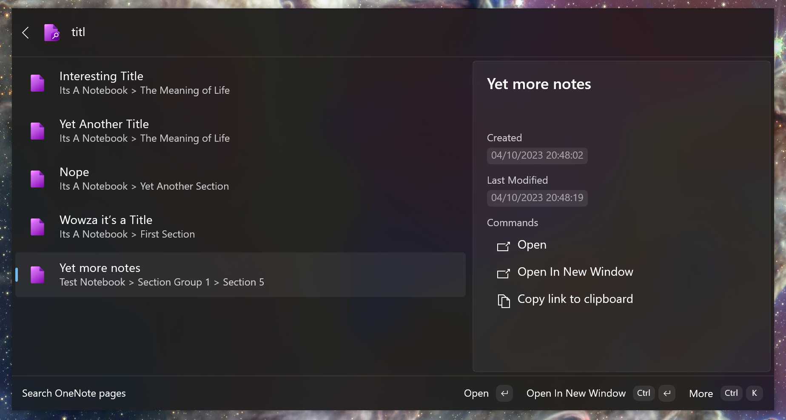
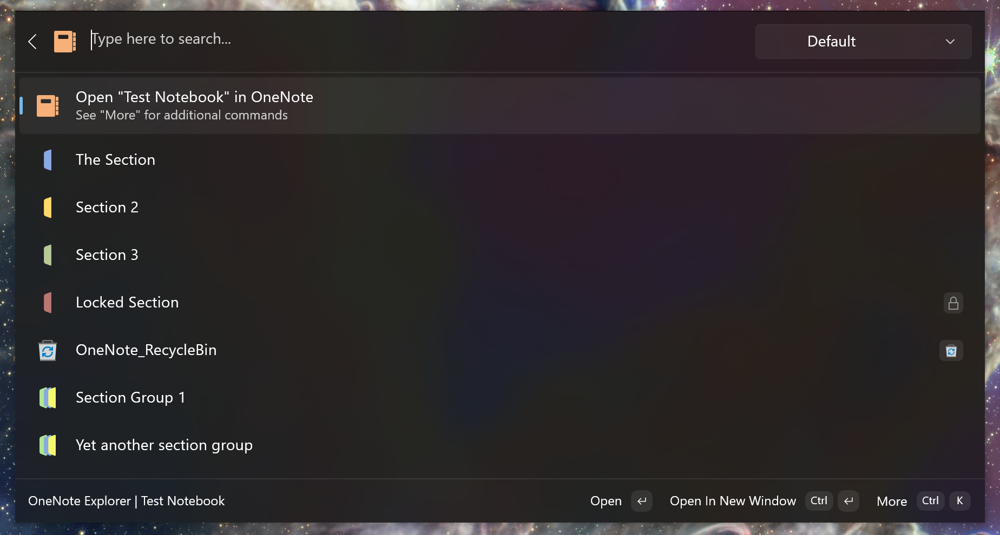
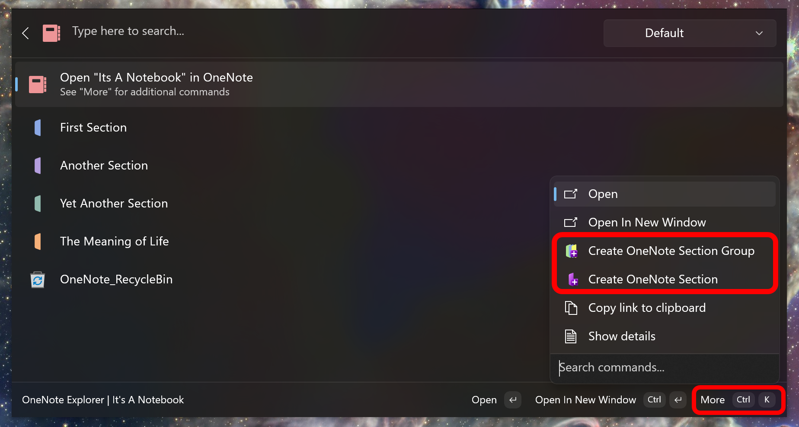
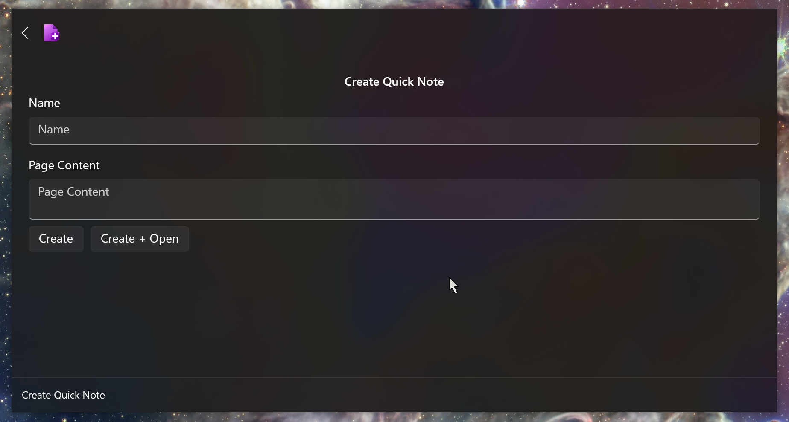



# OneNote for Command Palette

## Main Features

- [Search OneNote pages](#search-onenote-pages)
- [OneNote Explorer](#onenote-explorer):
  - View your OneNote structure without opening OneNote
  - Create OneNote pages, sections, section groups and notebooks.
- View recently edited pages
- [Create a _Quick Note_](#create-a-quick-note)

> [!IMPORTANT]
>
> - Requires OneNote to be installed.
> - For search to function, requires Windows Search on your computer to be enabled.
> - Creating a *Quick Note* requires a [Quick Note Section][quickNotesSection] to be set.

### Search OneNote Pages

> [!NOTE]
> You can include bitwise operators like `AND` or `OR` (they must be uppercase) in your search. E.g. `hello there AND general kenobi`.
> This only works when searching pages.

### OneNote Explorer

> [!NOTE]
> You can change the filter (the dropdown shown, top right in the image above) to search pages within a specific item.

#### Creating items

To create an item using the OneNote Explorer use the `More` action as shown above. This only works on the result that says `Open "{NAME}" in OneNote`

This leads the plugin to display a similar view as shown in the image in [Create a Quick Note](#create-a-quick-note), depending on wether you are creating a OneNote notebook, section group, section or page.

### Create a Quick Note

Creates a OneNote page at your [_Quick Notes Section_](quickNotesSection). To create a page in a specific section use the OneNote Explorer.

## Contributing

Pull requests for fixes and improvements are welcome! Though updates from me will be sparse.

[quickNotesSection]: https://github.com/user-attachments/assets/b248a12b-78b5-4d07-9e62-d39c2c4a8a19